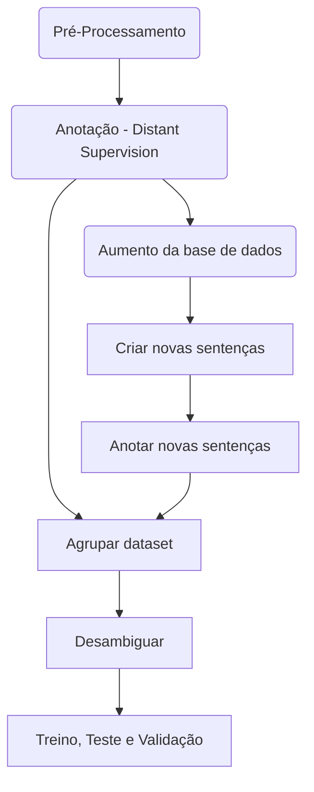

# Named Entity Recognition Dataset

## Descrição do Projeto
Este repositório tem a função de aprensentar uma metodologia e as ferramentas para a criação de um banco de dados para o treinamento de uma rede neural para a tarefa de reconhecimento de entidades nomeadas (NER) utilizando para tal a técnica de **distant siupervision**. Uma visão geral da metodologia para a criação da base de dados pode ser obsvervada na figura abaixo.

## Dataset 
Os datasets de treinamento, validação e test são formado por sentenças cujos labels então no formato IOB. O formato IOB (abreviação de dentro, fora, início) é um formato de marcação comum para tokens de marcação em uma tarefa de agrupamento em linguística computacional (por exemplo , reconhecimento de entidade nomeada ). Ele foi apresentado por Ramshaw e Marcus em seu artigo "Text Chunking using Transformation-Based Learning", 1995.

-   _B_: é uma tag que indica o início de um trecho de texto que representa a entidade de interesse.
-   _I_: é uma tag que indica que a o token está dentro de um trecho de texto que representa a entidade de interesse.
-   _O_: é uma tag indica que um token não pertence a entidade de interece.

Para a meotodolia proposta neste projeto a composição do dataset é baseada na técnica de distant supervision utilizando para tal listas de palavras relacionadas a cada entidade de interesse (da organização ou pessoa que for utilizar essa metodologia).

Também foram utilizadas técnicas para aumentar a quantidade de dados de treinamento da base de dados utilizando o máximo de palavras ou trechos de texto que representem as entidades de interesse presentes nas listas fornecidas já fornecidas.

O formato final consistem em um .csv com os tokens e labels respectivos. Um exmeplo pode ser observado abaixo:

||0|	1	|sentence|
|--|--|-----|--|
|0|	as|	O	|72543|
|1|	facilidades	|O|	72543|
|2|	levaram	|O|	72543|
|3|	ao	|O|	72543|
|4|	uso	|O|	72543|
|5|	desenfreado	|O|	72543|
|6|	do	|O|	72543|
|7|	recurso	|O|	72543|
|8|	e	|O|	|72543|
|9|	segundo	|O	|72543|
|10|	os	|O|	72543|
|11|	catadores	|O|	72543|
|12|	isso	|O|	72543|
|13|	diminuiu	|O|	72543|
|14|	o	|O|	72543|
|15|	numero	|O|	72543|
|16|	de	|O|	72543|
|17|	7et0550rn	|B|	72543|
|18|	.	|O|	72543|
|21|	foi	|O|	48925|
|22|	descoberto	|O|	48925|
|23|	pelo	|O|	48925|
|24|	poco	|O|	48925|
|25|	3-brsa-1295-rn	|B|	48925|
|26|	em	|O|	48925|
|27|	agosto	|O|	48925|

## Fluxo do projeto

 - **Pré-Processamento** Nesta etapa o texto contidos em todos os documentos .txt encontrados nas pastas dadas como entrada são lidos e sofrem uma limpeza.
 1. Remoção de caracteres especiais
 2. Separação da pontuação do texto (exemplo: teste: --> teste :) 
 
 - **Anotação:**
 - **Aumento da base de dados:**
 - **Criar novas sentenças:**
 - **Anotar novas sentenças:**
 - **Agrupar dataset:**
 - **Desambiguar:**
 - **Treino, Teste e Validação:**
